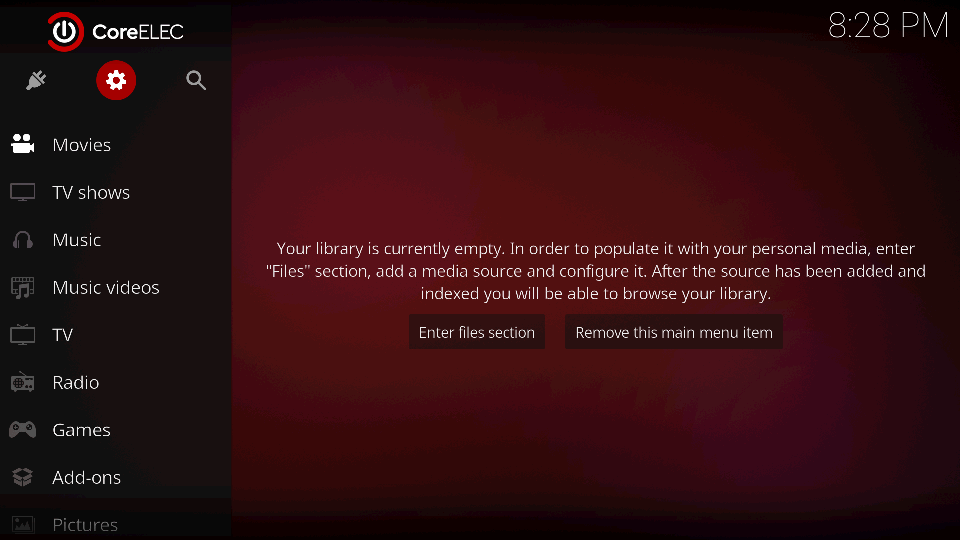
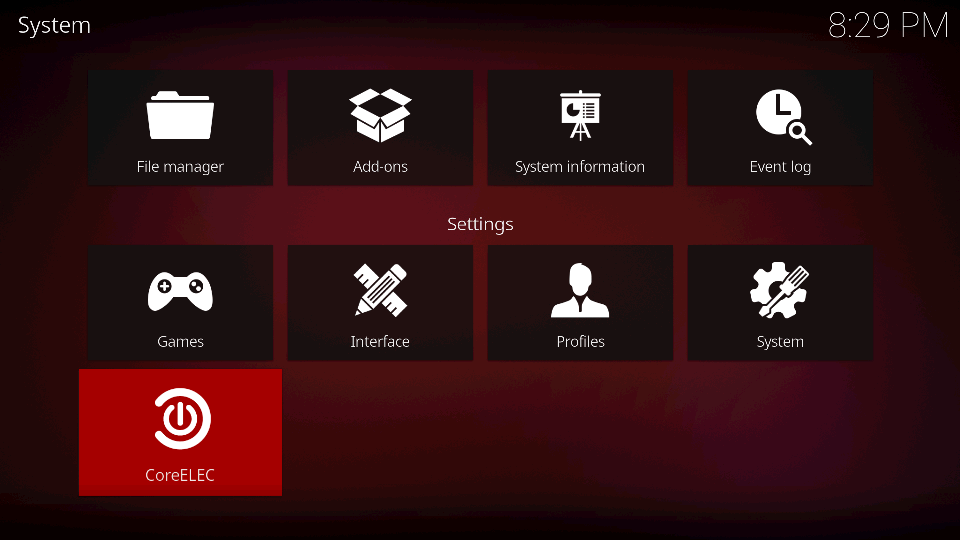
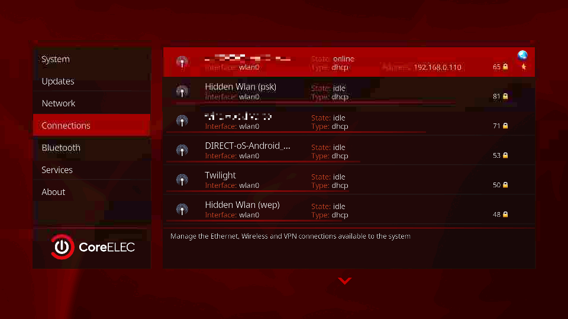
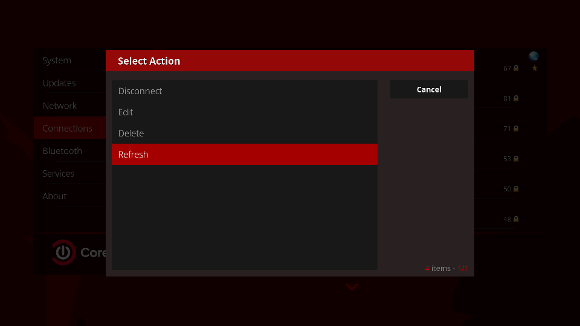
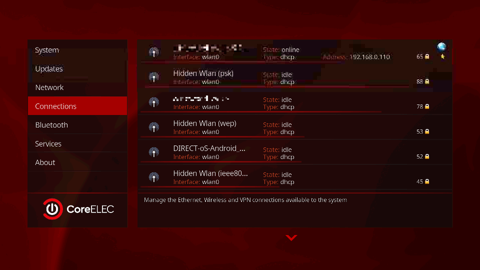

### Getting Started Guide for Demodulator Remote Debug Receiver

#### The Basics
The remote debug receiver device runs a custom Linux build from the installed SD-Card, please do not remove this card.
The device will need to be connected to the internet either via Wifi or a wired Ethernet connection to allow remote debugging
of the demodulator in the field. A terrestrial antenna should be connected to the Belling-Lee connector for DVB-T/T2/C and ISDB-T debug while a 
pointed dish/LNB feed should be connected to the F-type connector for DVB-S/S2 debug.

#### Controlling the box
The receiver can be controlled with either the supplied IR remote controller or with a USB mouse and keyboard.

#### Configuring the network
Please follow the following procedure to configure and confirm your network connection.

1. From the CoreElec home screen, click on the gear icon in the upper left to go to settings  
 
2. Next, click the CoreElec logo button to go to system settings.  If you are using a wired connection to a DHCP enabled gateway, then all you should 
need to do is connect the Ethernet jack to an active port on your network and jump to step 6.  If you are using Wifi, continue to step 3.  

3. Under Connections select the first or active connection and click enter  

4. Click Refresh and wait until the list of available Wifi networks is displayed  

5. Select your network, click, and then click connect  

6. You should see the world icon next to your network connection indicating there is internet access  

#### Remote Debug
Once the box has established an internet connection it will automatically establish a remote debug link with Availink's support office.  The Availink
support team will be able to control the box remotely,  running diagnostics, scanning channels, checking link status, and loading hot fix firmware to 
identify and correct the field issue.  The only activity needed in the field at this point may be to adjust the pointing of the antenna/dish as this can
not be accomplished remotely.
